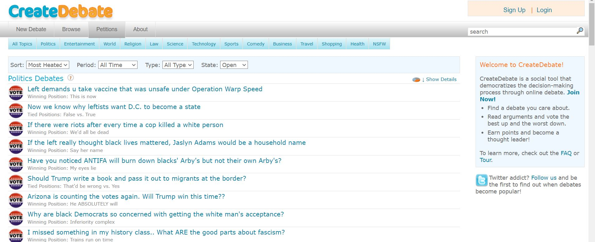

# CreateDebate Scraper API
[CreateDebate](https://www.createdebate.com/) is an online forum that allows students and experts alike to debate a variety of topics and practice persuasive writing. It has a large corpus of data related to a vast number of topics. This API allows to scrape all the debates related to a particular topic. There are two versions of this API: Linear and Nested. Linear API extracts the post comments but lacks the inherent nesting structure of comments on the webpage. Nested API removes this limitation by scraping the comments in a nested fashion.
## Tutorial
The URL structure of CreateDebate is pretty simple to decode. Consider the following URL
```
https://www.createdebate.com/browse/debates/all/mostheated/alltypes/alltime/Politics/0/24/open
```

Let's split the URL into following components:
* __Base URL__: `https://www.createdebate.com/browse/debates/all/`
* __Sort By__: <kbd>mostheated</kbd> (available options are <kbd>mostheated</kbd>, <kbd>mostrecent</kbd>, <kbd>mostarguments</kbd>, <kbd>mostvotes</kbd>, <kbd>newactivity</kbd> and <kbd>randomly</kbd>)
* __Type of Debate__: <kbd>alltypes</kbd> (other available options can be checked from the <kbd>Type</kbd> dropdown of the webpage)
* __Time of Debate__: <kbd>alltime</kbd> (other available options can be checked from the <kbd>Period</kbd> dropdown of the webpage)
* __Topic__: <kbd>Politics</kbd> (other available options can be checked from the webpage)
* __Offset__: Starting index of the post array (see Notes section for more detail)
* __PerPage__: Number of posts displayed on a single page (available options are 12, 24, 48 and 96; see Notes section for more detail)
* __State of Post__: <kbd>open</kbd> (other options are <kbd>closed</kbd> and <kbd>both</kbd>)

### Notes
CreateDebate displays subarray of the main post array using <kbd>[Offset : Offset + PerPage]</kbd> slicing. This API uses <kbd>PerPage</kbd> of 96, and <kbd>Offset</kbd> is increased in steps of 96 to scrape entire data set with given constraints.

## Requirements
* BeautifulSoup (bs4)
* networkx (for Nested API only)
* glom (for Nested API only)

## Start scraping
For scraping the CreateDebate website and creating a JSON data set, refer to this [notebook](https://colab.research.google.com/drive/12bJ2JBfJUW9_suDUl02WFSGQJMqzCUEB?usp=sharing).

To scrape all the debates under default constraints for <kbd>Politics</kbd>, run the following command
```bash
$ python scrape.py --data_dir dataset --tag Politics --page_count 104
```
Here, 104 is the total number of pages showed on the webpage when <kbd>PerPage</kbd> is set to 96. The parameters during scraping can be changed as per one's need.
